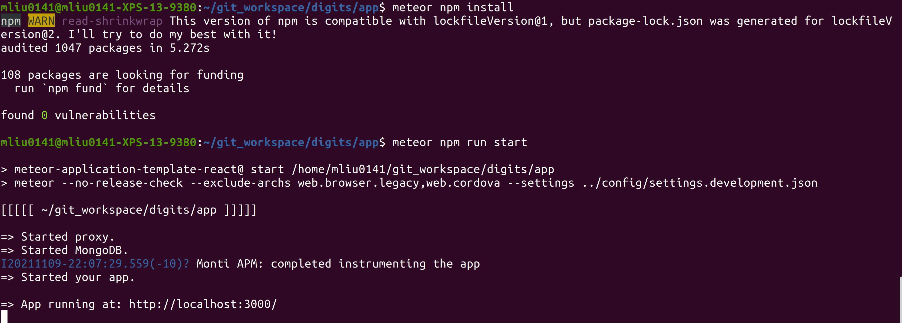
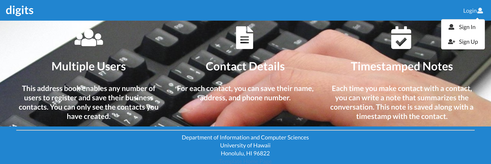
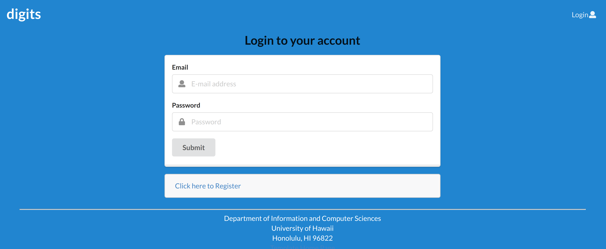
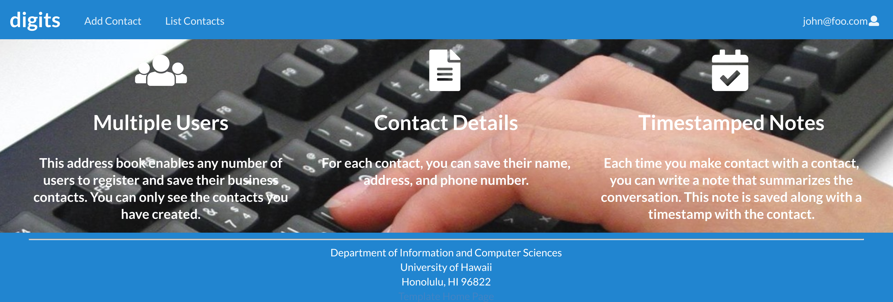
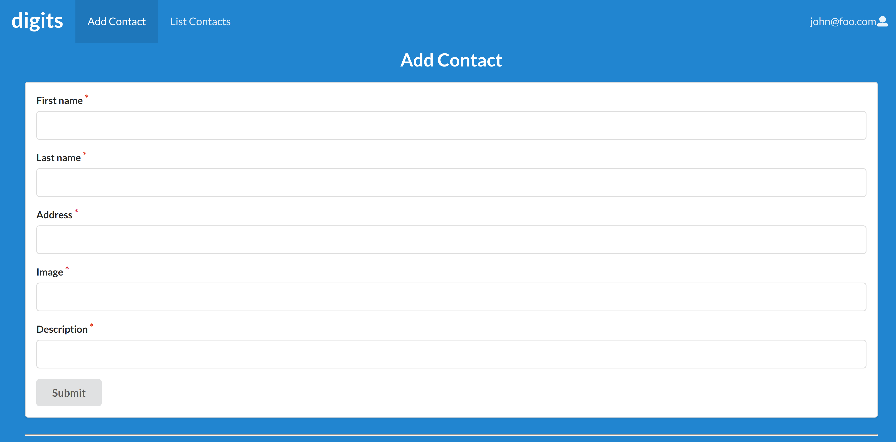
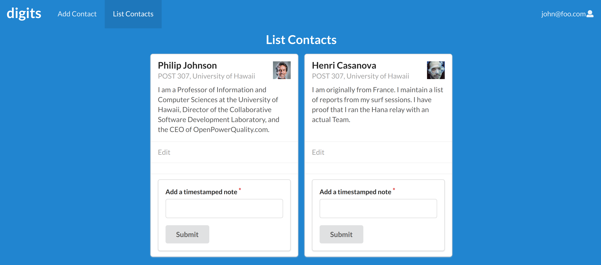
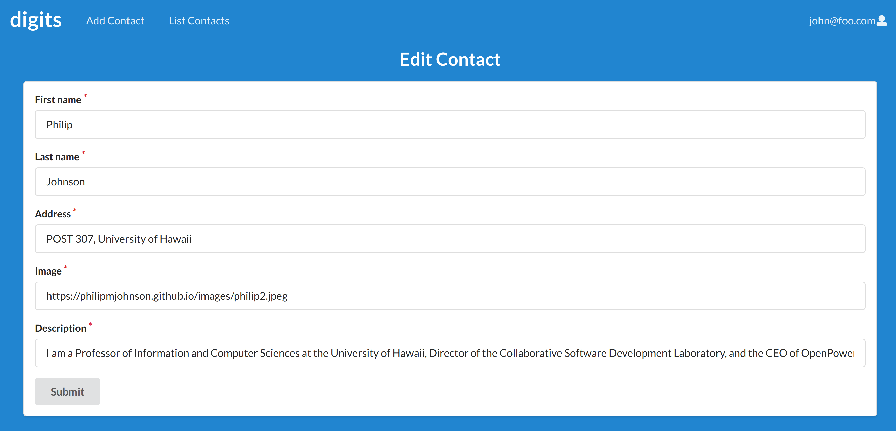

<br/>
Here is how the landing page going to looks like. In the navigation bar, once user click on the digits it will goes back to the landing page.<br/>
### To Getting start on the application
First user will need to clone this project to the computer.<br/>
Then go to the app directory by the following command:``` meteor npm install ``` to install the required libraries.<br/>
Run the application with following command: ``` meteor npm run start ``` in the same directory. <br/>
Everything should looks similar below: <br/>

Then run ``` http://localhost:3000/ ``` on the browser. It will goes to the landing page.<br/>
<br/>
On the top right corner of the navigation bar, there is a button for sign in/sign up.<br/>
<br/>
Once the user click on the sign in button, there will be the page with to enter the email address and password. The sign up page will be the same.
<br/>
Once user sign in, there will be more buttons on the navigation bar.
<br/>
After click on the "Add Contact" on the navigation bar, there will be a form for the user to fill out the informations and once they finish click on the submit button to uploads the informations.<br/>
<br/>
Another button "List Contacts" will list all the contacts in database that can be access by the account that user is using to sign in. Also, there are a note section for each contact, user can leave the note on the contact once they hit submit button. <br/>
<br/>
Each contact has a edit button, once user click on the edit, the page will shows all the informations for this contact, and user can make any changes on this page, then click submit button to update the contact.
